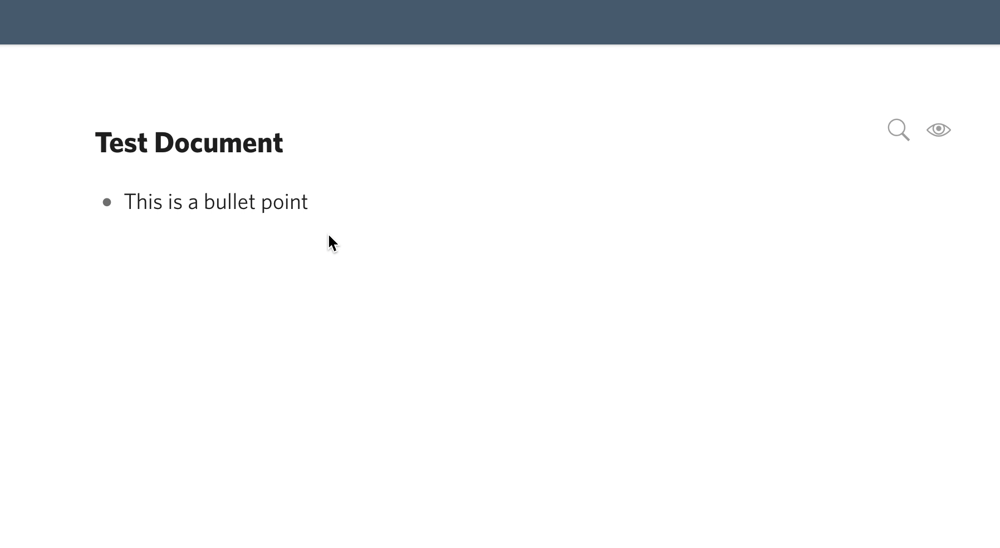

Over Christmas, I thought about reorganizing my notetaking system. In the last years, I tested almost any app that is out there. To name a few: Evernote, Notion, Google Keep, Standart Notes and Coda. In the end, I stuck with an app called Dynalist.

Dynalist is a smaller, geeky notetaking app that builds upon the idea of a [outliner](https://en.wikipedia.org/wiki/Outliner). A outliner is basically a text-editor where every piece of text is represented as a bullet-point.

The benefit of this approach is, that it's very easy to visualise relationships of notes because you can nest them infinitely. But the real cherry on top of the cake is the ability to zoom into a bullet point and only to show it's children. In that way, you can open a bullet-point as a single page.

Reading this makes it sound very complex. Let me give you a small demo of how it works.

Using Dynalist I can easily structure complex ideas and quickly jot down my ideas or articles. I'm writing this article here in Dynalist too.

But I was always missing something in my notetaking system. I'm spending a major chunk of my time reading articles, books and browsing through Twitter, Reddit and other forums. Not only for entertainment but also to be on the hunt for inspiration and great resources.

Until Chrismas, I was always lacking a system, where I can easily collect and curate insights and highlights that I came across on the internet.

That's when I found out about [Building a second brain](https://www.youtube.com/watch?v=SjZSy8s2VEE). The underlying idea is simple: You build a second brain in a digital form, where you save ideas and insights. That way you can focus your brain on understanding ideas and your second brain on saving ideas.

The idea really resonated with my struggle to organise my digital consumption and bookmarks.

Dynalist had no solution for capturing insights quickly. Yes, there is a chrome extension, but it can only capture bookmarks. If you want to capture snippets of text, you still have to copy and paste the text.

I set myself out to solve this, by building a small chrome extension myself. I've finished the first version and have been testing the extension myself for the last two weeks.

## Dynalist Highlighter

Dynalist Highlighter can be installed as a chrome extension and is disabled by per default. If you stumble upon something you like, you can fire up the extension and start highlighting a page. (Pro-Tip: Set yourself a Hotkey!)

The basic functionality is inspired by the way [Liner](https://getliner.com/c/all) and [Hypothes.is](https://web.hypothes.is/) works. After you select text, a small popup appears that offers you the option to highlight the selection.

In a small widget at the corner of the screen, you can always see how many Highlights you have and how the document will be named in Dynalist. If you are finished, you can send over the Bookmark and all Highlights to Dynalist.

That's it. But for me, it has been a big-time saver and I feel in love with taking highlights on everything that crosses my screen.

Here is a quick overview of some features:

- You don't need to select text precisely, the selection will always expand to include full words and trim empty space
- You can set your own Highlight Inbox (Where the extension will send your highlights)
- You can delete highlights if you made the wrong selection
- The highlights are automatically converted to Markdown and include links as well as bold and italic text (Kudos to [@leolabs](https://twitter.com/leolabs_org) for this idea)

There are two major things on my agenda, that I still want to implement -- if I can find the time. The first is the ability to make annotations on the highlights. This has been my initial idea for the extension, but it made more sense to start with just highlighting. The second feature is the ability to highlight images.
